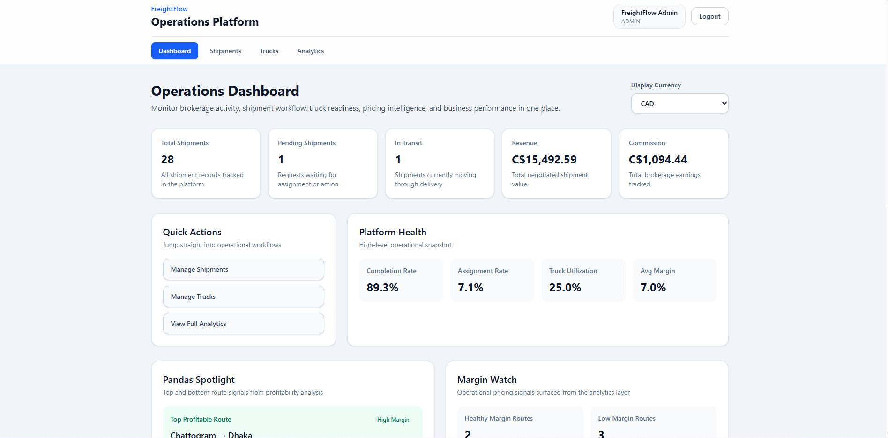
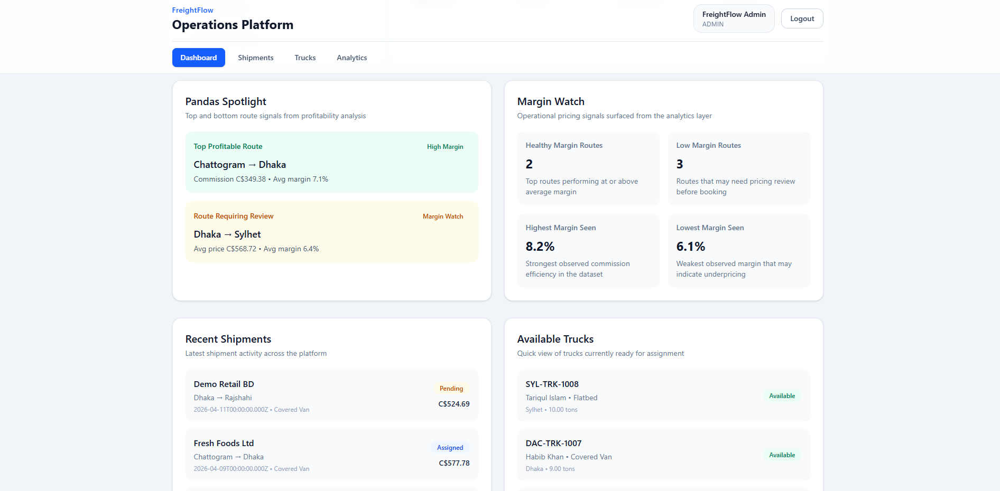
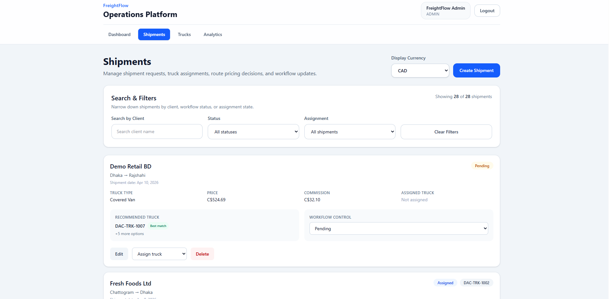
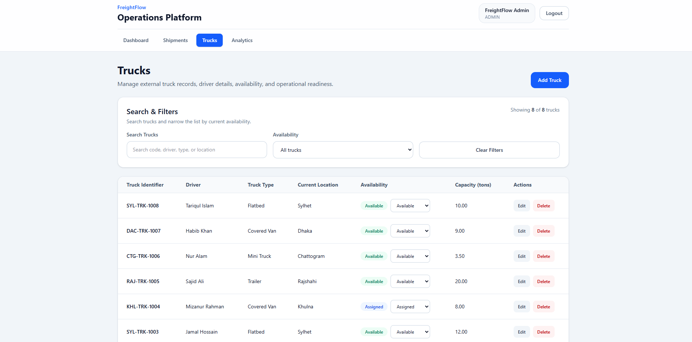
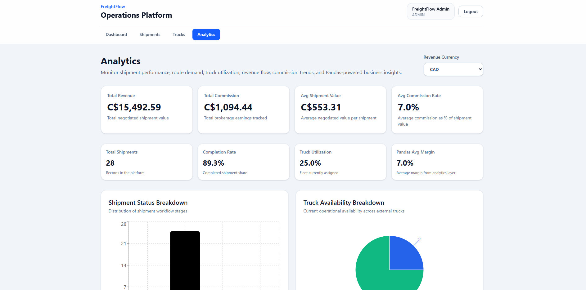
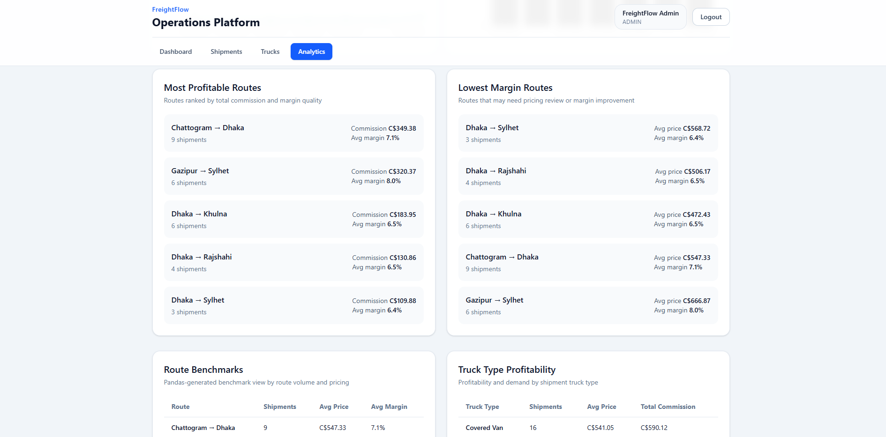

# 🚚 FreightFlow

Data-driven logistics brokerage platform for managing shipment operations, truck assignments, commission-based workflows, and route-level analytics.

🌐 **Live Demo:** https://freightflow-puce.vercel.app  
🎥 **Demo Video:** https://youtu.be/V2yE2vdnJWg  

---

## ✨ Features

* Quick Demo access for recruiters and public showcase
* Role-based access control (admin, demo admin, client)
* Create, edit, and manage shipment requests
* Assign, reassign, and unassign trucks
* Shipment workflow tracking (Pending, Assigned, In Transit, Completed)
* Truck availability management
* Dashboard with operational KPIs
* Route pricing benchmark insights during shipment creation
* Analytics page with revenue, commission, fleet, and workflow insights
* Python + Pandas-powered route profitability and margin analysis
* Demo reset flow to restore seeded public demo data

---

## 🏗️ Tech Stack

* **Frontend:** React (Vite), Tailwind CSS, React Router
* **Backend:** Node.js, Express
* **Database:** PostgreSQL
* **Analytics:** Python, Pandas
* **Visualization:** Recharts
* **Auth:** JWT, bcryptjs
* **Deployment:** Vercel (frontend), Render (backend + PostgreSQL)

---

## 📸 Screenshots

### 🚀 Login & Demo Access
<p align="center">
  
</p>

### 📊 Dashboard Overview
<p align="center">
  
</p>

<p align="center">
  
</p>

### 📦 Shipment Management
<p align="center">
  
</p>

### 🚛 Truck Operations
<p align="center">
  
</p>

### 📈 Analytics & Insights
<p align="center">
  
</p>

<p align="center">
  
</p>

<p align="center">
  
</p>

---

## ⚙️ Setup (Local)

### Clone Repo

```bash
git clone [paste your GitHub repo link here]
cd Freightflow

Backend
cd server
npm install
pip install -r requirements.txt
npm run dev
Frontend
cd client
npm install
npm run dev
🔐 Environment Variables

Create a .env file in server:

DB_HOST=your_postgres_host
DB_PORT=5432
DB_NAME=your_postgres_database
DB_USER=your_postgres_user
DB_PASSWORD=your_postgres_password
JWT_SECRET=your_secret_key
CLIENT_URL=http://localhost:5173

Create a .env file in client:
VITE_API_BASE_URL=http://localhost:5000
```
---

## 🧠 How It Works
React Frontend → Express API → PostgreSQL + Python/Pandas Analytics
Frontend sends shipment, truck, and analytics requests
Backend handles authentication, business logic, and database operations
PostgreSQL stores users, shipments, trucks, and workflow data
Python + Pandas process shipment and truck data for route-level analytics
Dashboard and analytics pages surface operational and profitability insights

---

## 📌 Notes
First request may be slower on Render free tier
Demo mode uses seeded synthetic logistics data
Public demo includes a reset flow to restore original demo data
Pandas analytics require requirements.txt dependencies during backend setup

---

## 🔮 Future Improvements
Toast notifications for major user actions
Custom confirmation modals instead of browser confirm dialogs
Exportable analytics and operational reports
Activity log / audit trail for shipment actions
Advanced client and company management workflows

---

## 👨‍💻 Author
Mahir Alam
(University of Calgary)

